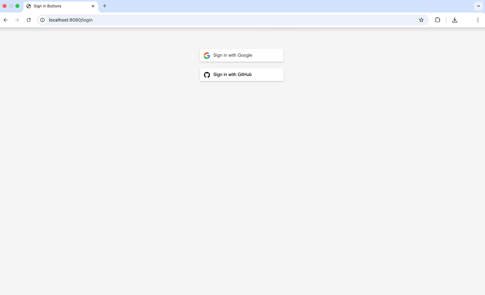

  
  

<h1 align="center">🔐 OAuth2 Login with GitHub & Google</h1>

A clean and secure implementation of OAuth2 login using GitHub and Google. Built for seamless integration into modern web applications.

## 🚀 Features

- ✅ Login with GitHub & Google using OAuth2
- 🔒 Secure authentication flow
- ⚙️ Easily pluggable into your app
- 🧩 Minimal configuration required
- ✨ Built with clean and extensible architecture

## 🛠️ Tech Stack

- **Spring Boot** – Backend REST API
- **Spring Security** – For authentication
- **Thymeleaf** – Frontend client
- **OAuth2** – Authentication Protocol

## 📸 Demo Screenshot

 
  
  
 

